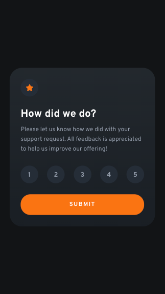

# Frontend Mentor - Interactive rating component solution

This is a solution to the [Interactive rating component challenge on Frontend Mentor](https://www.frontendmentor.io/challenges/interactive-rating-component-koxpeBUmI). Frontend Mentor challenges help you improve your coding skills by building realistic projects.

## Table of contents

- [Overview](#overview)
  - [Screenshot](#screenshot)
  - [Links](#links)
- [My process](#my-process)
  - [Built with](#built-with)
  - [What I learned](#what-i-learned)
  - [Continued development](#continued-development)
  - [Useful resources](#useful-resources)
- [Author](#author)

## Overview

### Screenshot

<i>screenshot for desktop</i>

 

<i>screenshot for mobile</i>

 

<i>screenshot for mobile</i>

### Links

- Solution URL: [github](https://github.com/Phenics13/frontendmentor-io-qr-code-component)
- Live Site URL: [netlify](https://bucolic-gumdrop-cff5a1.netlify.app/)

## My process

### Built with

- Mobile-first workflow
- [React](https://reactjs.org/) - JS library
- [TypeScript](https://www.typescriptlang.org/) - JavaScript with syntax for types
- [Styled Components](https://styled-components.com/) - For styles

### What I learned

I practiced my basic skills in React, TypeScript and Styled Components.

### Continued development

As I have said before I am going to focus on using TypeScript in the next challenges. Also I will complete some of them using Next.js in the future. By the way, I am going to try out Tailwind CSS. Wish me good luck 😊

### Useful resources

- [TypeScript challenges](https://github.com/type-challenges/type-challenges) - Challenges to bust your TypeScript knowledge.

## Author

- Website - [phenics13.github.io](https://phenics13.github.io/)
- LinkedIn - [Sergei Dranchenko](https://www.linkedin.com/in/sergei-dranchenko-93b800262/)
- Frontend Mentor - [@Phenics13](https://www.frontendmentor.io/profile/Phenics13)
- GitHub - [Phenics13](https://github.com/Phenics13)
